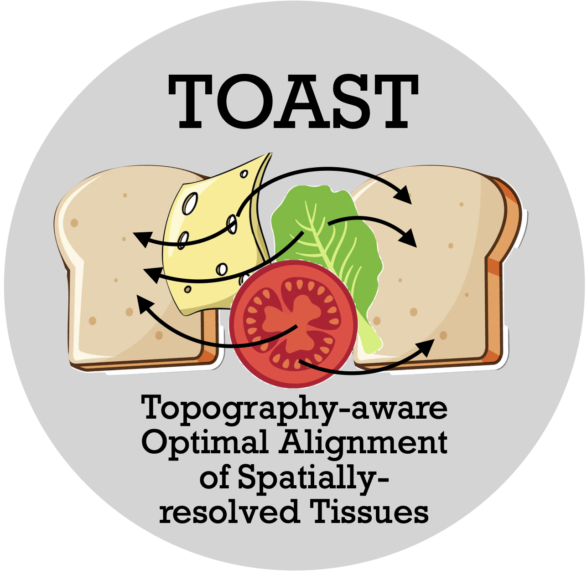
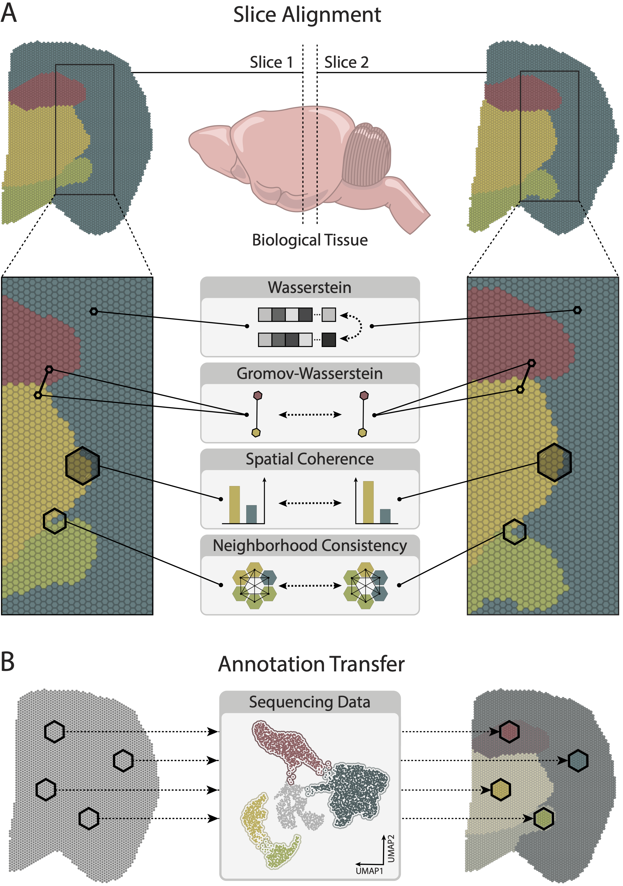

<table>
<tr>
<td></td>
<td>

# Spatially Aware Optimal Transport for Alignment of Spatial Omics Data

</td>
</tr>
</table>

<p align="left">
  

## Abstract
Optimal Transport (OT) has emerged as a foundational framework for analyzing and aligning distributions across various domains. Recent advancements in spatial omics technologies have provided unprecedented insights into the spatial organization of tissues, but challenges remain in aligning spatial slices and integrating complementary single-cell and spatial data. Here, we propose a novel OT-based framework, named TOAST, that extends the Fused Gromov-Wasserstein (FGW) distance to more comprehensively model the heterogeneity of local molecular interactions. By introducing spatial coherence, quantified through the entropy of local neighborhoods, and neighborhood consistency, which preserves the expression profiles of neighboring spots, TOAST’s objective function significantly improves the alignment of spatially resolved tissue slices and the mapping between single-cell and spatial data. Through comprehensive evaluations on both simulated and real-world datasets, including human brain cortex Visium data, Axolotl brain Stereo-seq data, mouse embryo seqFISH data, and Imaging Mass Cytometry from multiple cancer types, we demonstrate that our method consistently outperforms traditional FGW and other OT-based alignment methods. Specifically, TOAST improves the accuracy of spatial slice alignment, better preserves cell type compositions, recovers lineage trajectories in developmental brain data and reconstructs spatial relationships in spatial transcriptomics mouse embryo data. By integrating spatial constraints into OT, our framework provides a principled approach to enhance the biological interpretability of spatially resolved omics data and facilitate multimodal data integration.

## Summary

Optimal Transport (OT) is a mathematical framework that originates from the problem of transferring one distribution of mass to another in the most cost-efficient manner. OT has become a foundational tool across fields, including economics, machine learning, and biology. By providing a geometry-based approach to realize couplings between two probability distributions, OT facilitates the analysis and alignment of datasets originating from different domains. In biology, the ability to align and compare distributions is critical for studying complex systems such as multicellular tissues, where different cell types dynamically interact to maintain tissue function. For example, changes in cell composition, structure, and spatial organization often underlie the transition from healthy to diseased states. OT’s capacity to match distributions in a principled manner makes it an ideal tool for uncovering these cellular relationships and dynamics.

In this work, we introduce TOAST (Topography-aware Optimal Alignment of Spatially-resolved Tissues), a novel spatially aware Fused Gromov-Wasserstein (FGW) framework for spatial omics, which explicitly incorporates spatial constraints into the optimal transport objective. Our method extends the classical FGW formulation by introducing two additional terms, spatial coherence and neighborhood consistency, to account for spatial organization and molecular heterogeneity. We extensively evaluated TOAST on both simulated and real spatial omics datasets for the tasks of multislice alignment and integration of single-cell and spatial data, demonstrating its advantages over traditional FGW and other alignment methods. Our evaluation is based on data coming from spatial transcriptomics technologies such as 10x Visium, Stereo-seq and seqFISH, and spatial proteomics technologies, such as Imaging Mass Cytometry. By leveraging optimal transport in a spatially informed manner, our method provides a tool for studying tissue organization, tracking cellular dynamics across conditions, and enhancing multimodal data integration.

## Installation

To install the necessary dependencies, clone the repository and run:
```bash
git clone https://github.com/cecca46/TOAST
cd TOAST
pip install -r requirements.txt
```

## Project Structure

- **`spatial_OT/OT`**: Compute the spatially aware Optimal Transport between two spatial slices. 
- **`spatial_OT/utils.py`**: Provides additional utility functions such as data preprocessing, and graph construction.

## Reproducing the results
We provide the following python notebooks to reproduce the results in the paper for the simulated datatset, the Human LIBD data, Mouse Atlas and Stereo-seq data: **`DLPFC.ipynb`**, **`1d-sim.ipynb`**, **`2d-sim.ipynb`**, **`MouseAtlas.ipynb`** and **`StereoSeq.ipynb`**.
