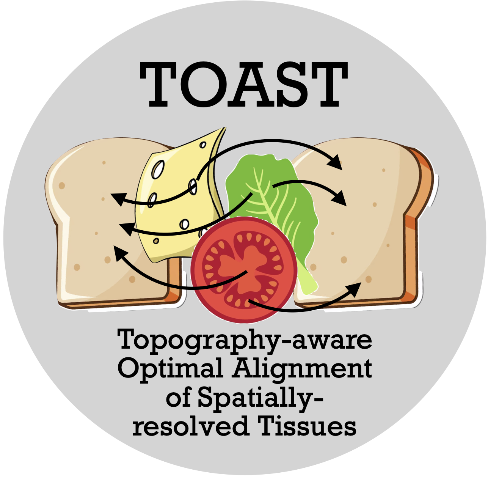

<table>
<tr>
<td></td>
<td>

# Topography Aware Optimal Transport for Alignment of Spatial Omics Data

</td>
</tr>
</table>

TOAST aligns spatial omics slices with an OT objective that combines expression similarity, global structure and local spatial constraints.

## Installation

```bash
pip install -r requirements.txt
pip install -e .
```

## Project layout

- `spatial_OT/OT.py`: core Sinkhorn-based transport solver.
- `spatial_OT/pipeline.py`: high-level alignment API.
- `spatial_OT/io.py`: CSV and AnnData adapters.
- `spatial_OT/preprocessing.py`: graph construction and feature preparation.
- `spatial_OT/costs.py`: cost matrix construction and normalization.
- `spatial_OT/metrics.py`: alignment metrics.
- `spatial_OT/cli.py`: command line interface.
- `notebooks/paper_reproduction/`: original notebooks for reproducing paper analyses.

## Quickstart (Python API)

### CSV input

```python
from spatial_OT import align_csv

result = align_csv(
    source_csv="data/simulations/2D_sim_t1.csv",
    target_csv="data/simulations/2D_sim_t2.csv",
    x_col="x",
    y_col="y",
    label_col="cell_type",
    alpha=0.5,
    epsilon=0.1,
    k=10,
    n_comps=8,
    use_spatial_terms=True,
)

transport = result.transport
metrics = result.metrics
```

### AnnData input

```python
import scanpy as sc
from spatial_OT import align_anndata

source = sc.read_h5ad("source.h5ad")
target = sc.read_h5ad("target.h5ad")

result = align_anndata(
    source_adata=source,
    target_adata=target,
    spatial_key="spatial",
    label_key="cell_type",
    embedding_key=None,      # optional precomputed embedding in obsm
    gene_join="intersection",  # default; harmonize genes across slices
    alpha=0.5,
    epsilon=0.1,
    k=10,
    n_comps=50,
    use_spatial_terms=True,
)
```

## CLI usage

Run CLI as a module:

```bash
python -m spatial_OT.cli align --help
```

Or via console script after `pip install -e .`:

```bash
toast align --help
```

### CSV mode

```bash
python -m spatial_OT.cli align \
  --source-csv data/simulations/2D_sim_t1.csv \
  --target-csv data/simulations/2D_sim_t2.csv \
  --x-col x \
  --y-col y \
  --label-col cell_type \
  --alpha 0.5 \
  --epsilon 0.1 \
  --k 10 \
  --n-comps 8 \
  --use-spatial-terms \
  --output-dir outputs/csv_example
```

### AnnData mode

```bash
python -m spatial_OT.cli align \
  --source-h5ad source.h5ad \
  --target-h5ad target.h5ad \
  --spatial-key spatial \
  --label-key cell_type \
  --gene-join intersection \
  --alpha 0.5 \
  --epsilon 0.1 \
  --k 10 \
  --n-comps 50 \
  --use-spatial-terms \
  --output-dir outputs/anndata_example
```

CLI outputs:

- `transport.npy`
- `transport.csv`
- `metrics.json`

## Reproducing paper analyses

All notebooks used in the original study are available in:

- `notebooks/paper_reproduction/`

## Data

Simulated data are included under `data/simulations/`.

For public datasets used in the study, see `data/README.md`.
